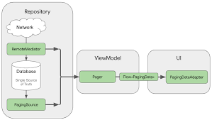

# RandomUserList

Random User List

This app shows a list of random users and the details of each one.

To obtain the list the following API was used
API: https://randomuser.me

The UI was implemented with Jetpack Compose

An attempt was made to apply the good practices of a Clean Architecture, separating the projects into layers (UI, Domain and Data)
and an MVVM presentation pattern.

Key technologies:
- Hilt
- Retrofit
- Room
- Page 3
- Coroutine
- Flow
- MVVM

[Screen Recording 2024-03-06 at 23.31.02.mov](..%2FScreen%20Recording%202024-03-06%20at%2023.31.02.mov)